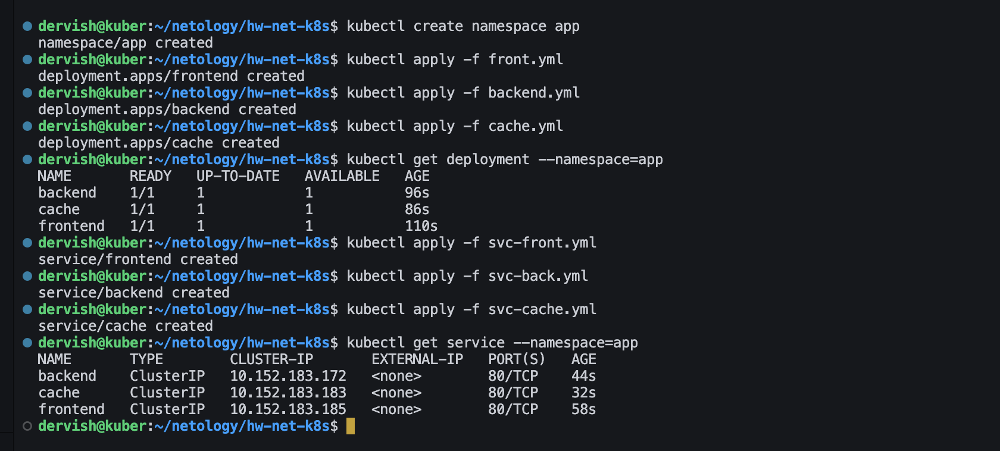
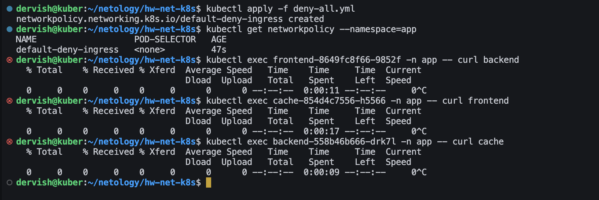
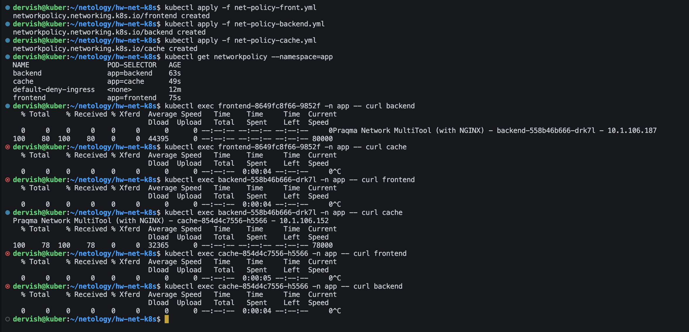

# Домашнее задание к занятию «Как работает сеть в K8s»

## Цель задания

Настроить сетевую политику доступа к подам.

## Чеклист готовности к домашнему заданию

Кластер K8s с установленным сетевым плагином Calico.

## Задание 1. Создать сетевую политику или несколько политик для обеспечения доступа

1. Создать deployment'ы приложений frontend, backend и cache и соответствующие сервисы.
2. В качестве образа использовать network-multitool.

> [frontend.yml](./front.yml) [backend.yml](./backend.yml) [cache.yml](./cache.yml)

> [svc-front.yml](./svc-front.yml) [svc-backend.yml](./svc-back.yml) [svc-cache.yml](./svc-cache.yml)

3. Разместить поды в namespace App.

4. Создать политики, чтобы обеспечить доступ frontend -> backend -> cache. Другие виды подключений должны быть запрещены.

>[deny-all.yml](./deny-all.yml) [net-policy-front.yml](./net-policy-front.yml) [net-policy-backend.yml](./net-policy-backend.yml) [net-policy-cache.yml](./net-policy-cache.yml)

5. Продемонстрировать, что трафик разрешён и запрещён.

>По умолчанию весь трафик между подами разрешен без ограничений

>Применим правило, которое запрещает любой трафик между подами

>Теперь применим политики, разрешающие только трафик от frontend к backend и от backend к cache. Другие виды трафика запрещены.

