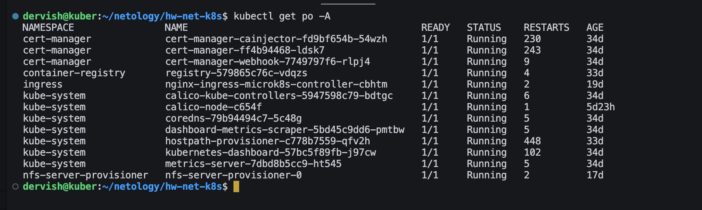
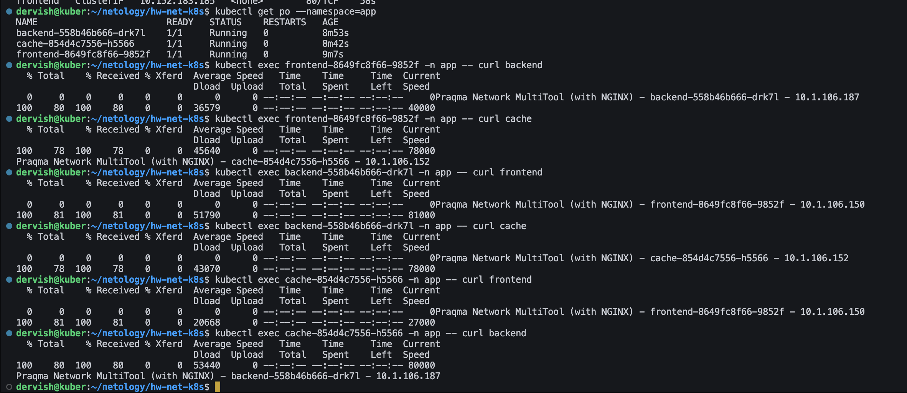

# Домашнее задание к занятию «Как работает сеть в K8s»

## Цель задания

Настроить сетевую политику доступа к подам.

## Чеклист готовности к домашнему заданию

Кластер K8s с установленным сетевым плагином Calico.

## Задание 1. Создать сетевую политику или несколько политик для обеспечения доступа

1. Создать deployment'ы приложений frontend, backend и cache и соответсвующие сервисы.
2. В качестве образа использовать network-multitool.

> [frontend](./front.yml) [backend](./backend.yml) [cache](./cache.yml)
> [svc-front](./svc-front.yml) [svc-backend](./svc-back.yml) [svc-cache.yml](./svc-cache.yml)

3. Разместить поды в namespace App.

4. Создать политики, чтобы обеспечить доступ frontend -> backend -> cache. Другие виды подключений должны быть запрещены.

[deny-all.yml](./deny-all.yml)

5. Продемонстрировать, что трафик разрешён и запрещён.

>По умолчанию весь трафик между подами разрешен без ограничений

>Применим правило, которое запрешает любой трафик между подами

